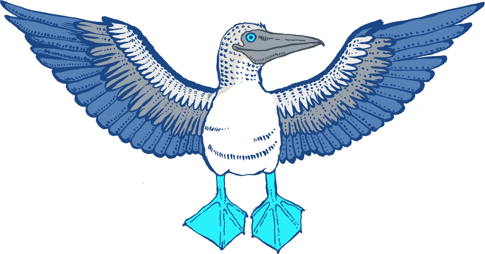
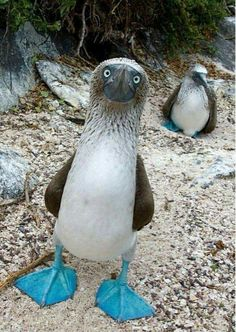

# ~~Twitter~~ Booby Frontend React

### Final Project of Internet Engineering lecture.
This is a twitter like social media with pretty much everything Twitter has and more (you can set gif as header😎).
find the backend [here](https://github.com/arman-aminian/twitter-backend). it has nothing to do with ...

### Nomenclature
According to Wikipedia, A booby is a seabird in the genus Sula, part of the family Sulidae. Boobies are closely related to the gannets (Morus), which were formerly included in Sula.
here is a cute picture of booby:

### How to See the result | [Official Website](https://booobier.herokuapp.com)
You can go to our website or clone the project and use `npm start` to run the app.

### Booby Team
- Myself
- [Mh Zarei](https://github.com/mhezarei)
- [Arman Aminian](https://github.com/arman-aminian)
